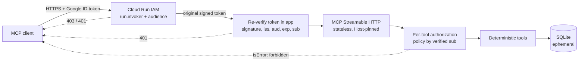

# Secure MCP Server on Google Cloud

[](https://github.com/tadinve/Inv_mcp_server/actions/workflows/ci.yml)

**Cresenta needs enterprise applications and AI assistants to read inventory
safely, while only specifically authorized callers can initiate restock
requests.**

Cresenta (a fictional company) runs three distribution centers. Planning tools and AI
assistants need live answers to two questions: *what's on hand* and *what needs
reordering*. A restock request is different: it starts a purchasing process, so
only specific, accountable callers may create one, and a network retry must never
create two.

This repository is a standalone [Model Context Protocol](https://modelcontextprotocol.io)
(MCP) server that serves exactly that. It has five typed tools over Streamable
HTTP, deployed on Cloud Run behind Google Cloud IAM, with per-tool permissions
checked against each caller's **verified** Google identity.

> **Scope.** An educational reference implementation with synthetic data, not a
> production-certified service. It contains no AI agent, no LLM and no agent
> framework. Any MCP client, including AI assistants, can consume it.

## Tool catalog

| Tool | Permission | What it does |
|---|---|---|
| `get_inventory` | `inventory.read` | Stock for a product across all warehouses; cost in integer minor units |
| `get_reorder_status` | `inventory.read` | Whether to reorder, and how much (`target = 2 × reorder_point`) |
| `list_low_stock_items` | `inventory.read` | Products below their reorder point, largest shortfall first |
| `list_restock_requests` | `inventory.read` | The caller's own restock requests |
| `create_restock_request` | `restock.create` | Records a request **for human review**; never places an order. Requires a UUID `idempotency_key`: retries replay, and conflicting reuse is rejected |

Every tool publishes typed input and output JSON Schemas generated from Pydantic
models. The business logic is deterministic Python; no model computes anything.

## Architecture



There are two independent boundaries:
- **Cloud Run IAM** decides who may *reach* the service.
- **The application** re-verifies the same Google-signed token and decides what
  each caller may *do*, per tool, from the token's verified `sub`.

The full design and engineering decisions are in
[architecture/system-design.md](architecture/system-design.md).

## Quick start (local, about 2 minutes)

Requires Python 3.13+ and [uv](https://docs.astral.sh/uv/). No cloud account is
needed.

```bash
git clone https://github.com/tadinve/Inv_mcp_server.git
cd Inv_mcp_server
uv sync --locked
uv run pytest
```

Start the server (terminal 1):

```bash
INVENTORY_AUTH_MODE=dev INVENTORY_POLICY_PATH=config/policy.dev.json uv run python -m inventory_mcp
```

Use the standalone client (terminal 2):

```bash
uv run python clients/mcp_client.py demo --token dev:writer
uv run python clients/mcp_client.py tools --token dev:reader
```

`demo` discovers the tools and calls each one, including an unknown product, an
invalid argument, a create, an idempotent replay and a conflicting reuse.
[demo/walkthrough.md](demo/walkthrough.md) has the full reader/writer story.

> **Dev authentication is TEST-ONLY.** `Bearer dev:<name>` is accepted without
> verification so the MCP surface can be explored locally. The server refuses to
> start in dev mode on Cloud Run, or on a non-loopback address without an explicit
> override. Permissions still come only from the server-side policy
> ([config/policy.dev.json](config/policy.dev.json)): `dev:reader` can read,
> `dev:writer` can also create, and every other identity gets nothing.

**MCP Inspector:** run `npx @modelcontextprotocol/inspector` and choose transport
*Streamable HTTP* with URL `http://127.0.0.1:8000/mcp`. Add one header: name
`Authorization`, value `Bearer dev:reader`.

**Container:**

```bash
docker build -t cresenta-inventory:local .
docker run --rm -p 127.0.0.1:8080:8080 -e PORT=8080 -e INVENTORY_AUTH_MODE=dev \
  -e INVENTORY_DEV_ALLOW_NON_LOOPBACK=true -e INVENTORY_POLICY_JSON="$(cat config/policy.dev.json)" \
  cresenta-inventory:local
```

## Deploying to Cloud Run

[deployment/README.md](deployment/README.md) lists the resources, IAM, cost and
safety guarantees. In short:

```bash
./deployment/deploy_cloud_run.sh
./deployment/verify_cloud_run.sh
./deployment/demo_cloud_run.sh
./deployment/cleanup.sh
```

Each script prints its plan with the resolved project, region and operator, and
asks for a typed confirmation before changing anything.

The deployment creates:
- a private service with the invoker IAM check enabled, scaling 0 to 1 instances;
- a runtime service account with no roles;
- three test identities: `mcp-reader` and `mcp-writer` with invoker access, and
  `mcp-outsider` with none.

No service-account keys are created; test tokens are minted by impersonation. The
scripts only touch resources they created, and a test suite audits them for that.

## Security model

| Layer | Mechanism | Failure |
|---|---|---|
| Edge | Cloud Run IAM `roles/run.invoker`; private invocation | 403 / 401 from Cloud Run |
| Authentication | App re-verifies the Google ID token: RS256 + `kid`, signature against Google's certificates, issuer, exact audience, `iat`/`exp`, non-empty `sub` | HTTP 401 `{"error":"unauthenticated"}`; MCP never runs |
| Host pinning | Only the configured service hostname reaches MCP | HTTP 421 |
| Argument validation | Schema check with sanitized errors (field names only, never values) | `isError: invalid_argument` |
| Authorization | Policy maps verified `sub` → permissions; deny by default; checked on **every** call before any logic or DB access | `isError: forbidden`, no side effects |
| Idempotency | `UNIQUE (caller sub, key)` + payload fingerprint, atomic transaction | Replay returns the original; a mismatch gives `idempotency_conflict` |
| Logging | Structured JSON: tool, verified principal label, allow/deny, outcome, latency | Tokens and argument values are never logged |

Key decisions, each with its trade-off, are in
[system-design.md](architecture/system-design.md#engineering-decisions):
- stateless Streamable HTTP;
- Google IAM/OIDC instead of MCP OAuth;
- re-verifying the token in-app;
- `sub` instead of email as the identity;
- per-tool permissions;
- ephemeral SQLite.

Threats, mitigations and residual risks are in
[architecture/threat-model.md](architecture/threat-model.md).

## Test evidence

| Kind | Result | Where |
|---|---|---|
| Local: unit, live-HTTP MCP, persistence with real threads, config guards, script audit | **197 passed** | `uv run pytest` (CI) |
| Simulated Google tokens: production verifier, locally generated RSA keys | **46 passed** | `uv run pytest -m simulated_google_auth` (CI) |
| Live Google identity, Checkpoint 2: Cloud Run token-forwarding PoC | **6/6 probes passed** | [deployment/poc/RESULTS.md](deployment/poc/RESULTS.md) |
| Live Google identity, Checkpoint 3: deployed server, real reader/writer/outsider | **15/15 integration tests passed**; `sub == uniqueId` 3/3; 0 tokens in 150 log entries | [deployment/RESULTS.md](deployment/RESULTS.md) |

Simulated tests prove the verifier's *logic*. They are not real Google
authentication, and they are labeled and marked as such. The live tests need GCP
credentials, never run in CI, and are reported as NOT RUN when skipped. The
complete breakdown, including what is **not yet validated**, is in
[demo/expected-results.md](demo/expected-results.md).

Highlights from the live run:
- A reader's write was `forbidden` and changed nothing.
- A writer's retry returned the same `request_id`.
- 8 concurrent identical submissions were stored once.
- A token sent only in `X-Serverless-Authorization` was admitted by Cloud Run
  but refused by the app, because Cloud Run strips its signature.
- Requests to the service's second hostname got 421.

## Protocol notes (mcp SDK 2.3.0, measured)

- The SDK client negotiates protocol **2026-07-28** via `server/discover`. The
  `initialize` handshake (**2025-11-25**) also works.
- Malformed JSON gets HTTP 400 with JSON-RPC `-32700`.
- Invalid arguments and unknown tools come back as tool results with
  `isError: true`, not JSON-RPC errors. This follows the SDK.
- `tools/list` shows all five tools to authenticated callers. **Discovery is not
  an authorization grant.**

### Why MCP, and how to consume it

MCP gives AI assistants and applications one standard way to *discover* tools
with machine-readable schemas and *call* them. A REST API would need a bespoke
client and documentation for each consumer. Any MCP client that supports
Streamable HTTP and a custom `Authorization` header can use this server: send a
Google ID token whose audience is the service URL, for an identity the policy
grants.

## Limitations

- **Not durable.** SQLite lives in `/tmp` on one instance. Data is lost on scale
  to zero or redeploy, and idempotency guarantees go with it. Firestore is the
  documented production path (not implemented).
- **One instance.** `--max-instances=1` is what keeps SQLite consistent; it is not
  a scaling design.
- **No MCP OAuth.** There is no authorization-server discovery, Protected Resource
  Metadata or consent flow. General-purpose MCP clients that expect OAuth need
  extra work. The server does not claim MCP OAuth compliance.
- **No rate limiting.** A stolen valid token works until it expires (up to 1 hour).
- **Verified once live**, on a temporary lab project in one region (2026-10-08).

## Repository layout

```
src/inventory_mcp/   server · tools · inventory_service · repository · authentication · authorization
                     schemas · config · observability · data/inventory.json (synthetic catalog)
clients/             mcp_client.py (standalone MCP client, no LLM) · gcloud_identity.py (token minting)
config/              policy.dev.json (TEST-ONLY) · policy.example.json (Google mode template)
deployment/          deploy / verify / demo / cleanup scripts · tools/ (verify helpers) · RESULTS.md
deployment/poc/      Cloud Run token-forwarding proof-of-concept · RESULTS.md
architecture/        system-design.md · threat-model.md
demo/                walkthrough.md · expected-results.md (test evidence)
tests/               local + simulated suites · integration/ (live, opt-in)
```

The original requirements are in [SPEC.md](SPEC.md) and
[SPEC-AMENDMENT-1.md](SPEC-AMENDMENT-1.md).

## License

[MIT](LICENSE). Built on the official [MCP Python SDK](https://github.com/modelcontextprotocol/python-sdk)
and [google-auth](https://github.com/googleapis/google-auth-library-python).
Deployment approach informed by Google's
[secure MCP server codelab](https://codelabs.developers.google.com/secure-mcp-server-gcp)
and [Cloud Run service-to-service authentication](https://cloud.google.com/run/docs/authenticating/service-to-service).
All company names, products, suppliers and warehouses are fictional.
