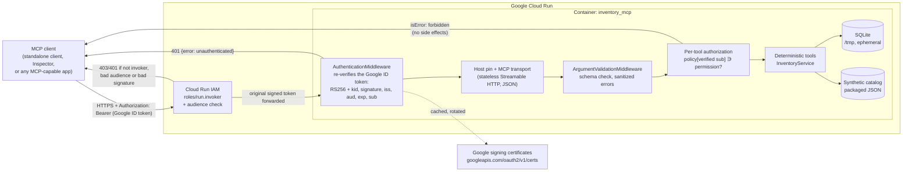

# System design

A standalone MCP server that gives enterprise applications and AI assistants
safe, typed access to Cresenta's (synthetic) inventory. It has two security
layers: Google Cloud IAM at the edge, and per-tool permissions keyed by verified
identity inside. It contains no agent, no LLM and no agent framework.

## Request path



Plain-text version:

```
MCP client ──HTTPS + Google ID token──▶ Cloud Run IAM ──▶ AuthenticationMiddleware ──▶ Host pin / MCP transport
                                         │ 403/401            │ 401                         │ 421
                                         ▼                    ▼                             ▼
                                      rejected             rejected                     rejected
   ──▶ ArgumentValidationMiddleware ──▶ per-tool authorization ──▶ deterministic tools ──▶ SQLite (ephemeral)
        │ isError: invalid_argument      │ isError: forbidden          │ isError: not_found / idempotency_conflict
```

Locally, the same container or process runs with TEST-ONLY dev authentication
(`Bearer dev:<name>`) and no Cloud Run in front.

## Components

| Module | Responsibility |
|---|---|
| [server.py](../src/inventory_mcp/server.py) | Assembles the MCP server, Streamable HTTP app, health route and authentication middleware |
| [authentication.py](../src/inventory_mcp/authentication.py) | `GoogleOIDCAuthenticator`, certificate cache, `DevAuthenticator` (test-only), ASGI middleware |
| [authorization.py](../src/inventory_mcp/authorization.py) | Permission enum, policy loaded from JSON, deny-by-default decisions |
| [tools.py](../src/inventory_mcp/tools.py) | Five MCP tools; the `_execute` wrapper (authorize → run → map errors → log); argument-sanitizing middleware |
| [inventory_service.py](../src/inventory_mcp/inventory_service.py) | Deterministic business logic: reorder formula, low-stock ordering |
| [repository.py](../src/inventory_mcp/repository.py) | SQLite restock requests with principal-scoped idempotency |
| [schemas.py](../src/inventory_mcp/schemas.py) | Pydantic contracts, which become the published input and output schemas |
| [config.py](../src/inventory_mcp/config.py) | Environment configuration and fail-closed startup guards |
| [observability.py](../src/inventory_mcp/observability.py) | Structured JSON logs in the shape Cloud Logging parses |

## Tools

| Tool | Permission | Behavior |
|---|---|---|
| `get_inventory` | `inventory.read` | Stock per warehouse, integer minor-unit cost |
| `get_reorder_status` | `inventory.read` | `target = 2 × reorder_point`; reorder when `on_hand < reorder_point`; quantity `target − on_hand` |
| `list_low_stock_items` | `inventory.read` | Shortfall descending, then product ID |
| `list_restock_requests` | `inventory.read` | The caller's own requests only |
| `create_restock_request` | `restock.create` | Records a request for human review; idempotent per `(caller sub, idempotency_key)` |

## Engineering decisions

### 1. Stateless Streamable HTTP with JSON responses
- **Decision:** `stateless_http=True`, `json_response=True`, one `POST /mcp` per request.
- **Why:**
  - Cloud Run routes each request to any instance, and stateless MCP needs no
    session affinity or sticky sessions.
  - JSON responses (not SSE) are simpler to proxy, log and test, and none of the
    five tools streams.
  - Streamable HTTP is the current MCP remote transport; the older HTTP+SSE
    transport is deprecated.
- **Measured:** the SDK client negotiates protocol `2026-07-28` via
  `server/discover`. The `initialize` handshake (`2025-11-25`) also works and is
  tested.
- **Cost:** no server-initiated messages (progress notifications, sampling,
  elicitation). None of the tools needs them.

### 2. Google IAM/OIDC rather than full MCP OAuth
- **Decision:** Cloud Run IAM (`roles/run.invoker`) at the edge, plus in-app
  verification of the same Google-signed ID token. MCP-native OAuth (authorization
  server, Protected Resource Metadata, dynamic client registration) is out of scope.
- **Why:**
  - The callers are enterprise workloads (service accounts), not end users
    granting consent.
  - Google already issues short-lived, signed, audience-bound tokens to them, with
    no keys.
  - Running an OAuth authorization server would add a component to secure and
    operate without serving these callers.
- **Cost:** general-purpose MCP clients that expect OAuth discovery and consent
  (for example a consumer chat app) cannot connect without extra work. The README
  states this; the server does not claim MCP OAuth compliance.

### 3. Verify the token again inside the app
- **Decision:** don't trust "it passed IAM". The app verifies:
  - the signature, against Google's certificates;
  - `alg` is RS256 and a `kid` is present;
  - issuer and exact audience;
  - `iat`/`exp`;
  - a non-empty `sub`.
- **Why:** defense in depth. A misconfigured ingress, a disabled invoker check, or a
  path that bypasses the front end must not turn into unauthenticated tool access.
- **Evidence:**
  - The PoC proved Cloud Run forwards the **original signed** token in
    `Authorization`.
  - It also proved Cloud Run strips the signature from `X-Serverless-Authorization`,
    so that header is never trusted.

### 4. Verified `sub` as the identity
- **Decision:** the policy maps the token's verified `sub` (the service account's
  `uniqueId`) to permissions. Email is a log label only, shown only when
  `email_verified` is true.
- **Why:** an email can be reused after an account is deleted and recreated; `sub`
  cannot.
- **Evidence:** a live check confirmed `sub == uniqueId` for reader, writer and
  outsider. It is now a required integration test.

### 5. Per-tool permissions, checked on every call
- **Decision:** two permissions (`inventory.read`, `restock.create`), deny by
  default, checked inside each tool call before any business logic or database
  access. `tools/list` shows all tools to authenticated callers.
- **Why:**
  - Having the invoker role answers "may you reach the service", not "may you
    write".
  - Checking at call time, not at discovery, means hiding tools is never mistaken
    for access control.
- **Evidence:**
  - A reader's write is `forbidden` with no row written (local and live tests).
  - Discovery is not an authorization grant (tested).

### 6. Ephemeral SQLite, one instance, for the demonstration
- **Decision:** SQLite in `/tmp`, with `--max-instances=1`.
- **Why:**
  - It is the smallest thing that demonstrates real persistence semantics:
    transactions, a uniqueness constraint, and concurrent writers.
  - It needs no extra cloud service.
  - One instance keeps the single database consistent.
- **Cost:** not durable. Data is lost on scale to zero, revision rollout or
  instance replacement, and idempotency guarantees go with it. Firestore is the
  documented production alternative and is not implemented.

### 7. Sanitized argument errors
- **Decision:** a middleware runs the SDK's own argument validator first and returns
  a typed `invalid_argument` error listing field names and error types only.
- **Why:** the SDK's default message echoes submitted values back, and those can
  be sensitive.

### 8. Fail-closed configuration
- **Decision:** startup refuses:
  - an unknown auth mode;
  - a missing policy, or more than one policy source;
  - Google mode without an https audience;
  - Google mode off loopback without `INVENTORY_ALLOWED_HOSTS`;
  - dev auth when a Cloud Run marker is set, or on a non-loopback bind without an
    explicit local override.
- **Why:** every insecure state should be impossible to reach by forgetting a
  variable.

## Data

- **Catalog:** 20 synthetic products across 3 synthetic warehouses, packaged inside
  the Python package (`inventory_mcp/data/inventory.json`). It covers zero stock,
  exactly-at-threshold, reorder point 0, multi-warehouse, EUR pricing and
  large/small unit costs.
- **Restock requests:** SQLite table with `UNIQUE (principal_sub, idempotency_key)`
  and a SHA-256 fingerprint of canonical JSON of (product, quantity, justification).
  Insert-or-replay runs inside `BEGIN IMMEDIATE`.

## Deployment shape

| Setting | Value |
|---|---|
| Invocation | Unauthenticated access disabled; `--invoker-iam-check` |
| Ingress | `all` (internet-reachable, IAM-protected, needed for laptop testing) |
| Scaling | min 0, max 1 instance; concurrency 20 |
| Runtime identity | Dedicated service account with no roles |
| Callers | `mcp-reader`, `mcp-writer` (invoker); `mcp-outsider` (none) |
| Config | Env vars: Google mode, audience = service URL, allowed host = service host, policy JSON keyed by uniqueId |

See [deployment/README.md](../deployment/README.md) for commands and
[threat-model.md](threat-model.md) for threats and mitigations.
